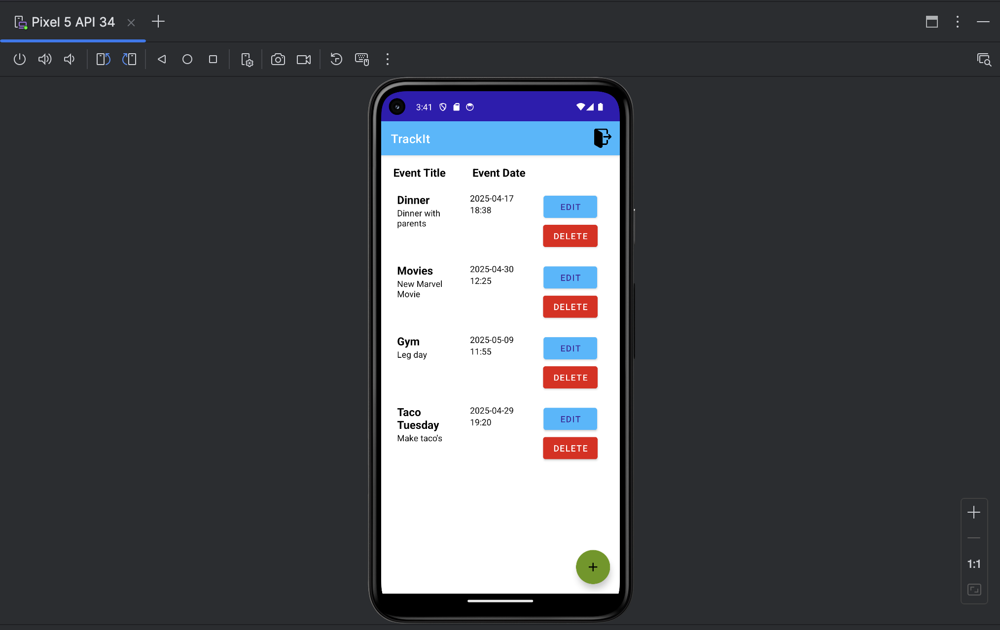
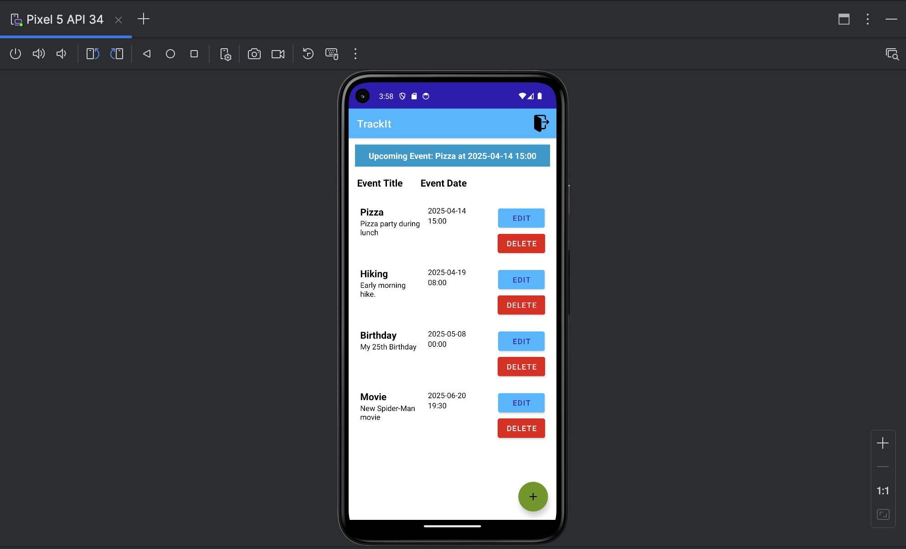

# Capstone-Artifact-2

# TrackIt - Event Tracking Mobile Application

**TrackIt** which is an event tracking mobile application to help users manage and track upcoming events such as meetings, concerts, and appointments. It includes features like adding, editing, and deleting events, with SMS notifications and clean UI. This artifact is from the course CS-360 Mobile Architecture and Programming. For this project I created a mobile app named TrackIt using Android studio. The requirements for the mobile application was a sign-up and login function, a database to store user credentials and event information, and SMS notifications. Once a user added a new list/event item, they would receive an SMS message about their planned event. The planned enhancement was for the **Algorithms and Data Structures** category. You will see that the original artifact is named **Comp360_final_project** and the enhanced version is named **trackit_enhanced_artifact**.

---

## Code Enhancements
- Refactored all comments and documentation to follow industry standards.
- Removed unused and redundant code.
- Validated user inputs.
- Implemented proper error handling and logging.
- Improved structure for better maintainability and readability.

## Algorithms
- Implemented Merge Sort to arrange events in chronological order (year, month, day, hour, minute).
- Users will now see their event list in correct sequence.

## Data Structures
- Priority Queue added to determine and display the upcoming event efficiently.
- This is displayed in a new banner at the top of the RecyclerView for the event list.

---

## Technologies Used
- Java
- Android Studio
- SQLite
- XML
- Gradle

---

## Screenshots

### Before Enhancement 

### After Enhancement

